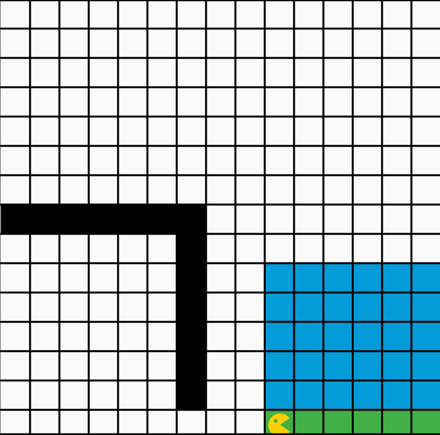

# Studienleistung I: Bouncer | 3. Bouncer gräbt nach Kristallen

## Allgemeine Hinweise zur Studienleistung
In dieser Studienleistung werden Sie drei Programmieraufgaben lösen.
Diese Programmieraufgaben sind auf drei Projekte - pro Teilaufgabe ein Projekt - aufgeteilt.
Um die Aufgaben zu bearbeiten, müssen Sie zuerst das jeweilige Projekt in IntelliJ öffnen.
Diese Projekte sind:
* ```Studienleistung-I-Bouncer-1-BouncerMaltEineSpirale```
* ```Studienleistung-I-Bouncer-2-BouncerBautEineBrücke```
* ```Studienleistung-I-Bouncer-3-BouncerGraebtNachKristallen```

Für die Teilaufgabe, die in diesem Dokument beschrieben ist, öffnen Sie bitte das Projekt: ```Studienleistung-I-Bouncer-3-BouncerGraebtNachKristallen```

Nutzen Sie zum Lösen der einzelnen Aufgaben die bereitgestellten Klassendateien.
Zum Einreichen Ihrer Aufgaben nutzen Sie die entsprechende Funktion in GRIPS.
Falls Sie Problemen mit dem Starterpaket oder dem Einreichen der Aufgabe haben, können Sie sich in den Handouts auf GRIPS informieren.

Achtung: Eine Verlängerung der Abgabefrist ist nicht möglich.
Einreichungen, die uns (zu spät) per E-Mail erreichen, werden nicht mehr berücksichtigt.
Alle nicht eingereichten Aufgaben werden mit nicht bestanden bewertet.
Testen Sie den Upload am besten schon vor Ablauf der Frist in Ruhe: Sie können bis zum Abgabetermin beliebig viele neue Lösungen einreichen.

Bewertungskriterien: Für die gesamte Studienleistung gilt, dass die eingereichten Lösungen nur die in der Aufgabenstellung beschriebenen Probleme lösen sollen.
Lassen Sie keinen Teil der jeweiligen Aufgabe weg und interpretieren Sie die Fragestellung nicht selbstständig.
Bewertet wird, in wie weit Sie das beschriebene Problem vollständig lösen.
Wenn Sie die Aufgaben erfolgreich bearbeitet haben, können Sie Ihre Lösung gerne kreativ gestalten und erweitern; achten Sie dabei darauf, dass die eigentlichen Anforderungen weiterhin erfüllt bleiben.
Die Qualität Ihres Codes fließt in die Gesamtbewertung mit ein: Nutzen Sie Decomposition um Ihre Programme übersichtlich zu gestalten.
Verwenden Sie sinnvolle Bezeichner für Variablen und Methoden und kommentieren Sie ausreichend.
Beachten Sie dazu die Kriterien für guten und schlechten Code, die in der Vorlesung erwähnt wurden.

Sollten Sie Fragen haben oder Hilfe brauchen, können Sie im Discord unter der Kategorie Support in den Channel Studienleistung uns eine Nachricht hinterlassen.
Wir stehen Ihnen dann zeitnah zur Seite über eine Direktnachricht.


## Ausgangslage

Bouncer steht in einer Welt mit einer großen Höhle an der linken Wand.
Die Höhle hat immer genau einen Eingangstunnel der genau ein Feld breit ist.
Bouncer steht rechts neben der Höhle und links von einer Palette (grüne Felder).
Außerdem sind innerhalb der Höhle keine Hindernisse und eine Höhle ist ein rechteckiger Raum.
Innerhalb der Höhle gibt es abtragbare Erde (grüne Felder).
Über die ganze Breite der Höhle befindet sich auf Höhe des Eingangs nie Erdreich.
Bouncer will das in der Höhle befindliche Erdreich abbauen und aus der Höhle schaffen.
Dazu verwendet Bounder einen Rucksack, den Bouncer mit Erdreich befüllt bis dieser voll ist.
Ist der Rucksack voll, geht Bouncer zurück zum Eingang der Höhle.
Auf der rechten Seite der Höhle, ist eine *Palette* aus grünen Feldern auf der Bouncer Erdreich platziert und stapelt.
Danach begibt sich Bouncer zurück in die Höhle, sucht wo Bouncer weitergaben kann und füllt den Rucksack wieder auf.
Bouncer macht das solange bis die Höhle leer ist.
Sobald die Höhle leer ist, leert Bouncer ein letztes Mal den Rucksack und stoppt dann links neben der Palette und schaut nach Osten.

Ihr Programm soll für beliebige Höhlen, innerhalb obiger Regeln, funktionieren.
Testen Sie daher ihr Programm mit allen drei mitgelieferten Maps (cave, cave2, cave3).

| Bouncer steht in einer Welt mit einer Höhle vor Bouncer und Paletten hinter und vor Bouncer. | Bouncer hat die Höhle abgetragen und Erdreich und Kristalle getrennt von einander gestapelt. |
|:------:|:------:|
|  |  |

## Aufgabe

Lösen Sie folgende Teilaufgaben, damit Bouncer alle Kristalle in einer Höhle findet und alles Erdreich abtärgt.

1. Bouncer muss die Höhle zum ersten Mal betreten
2. Bouncer muss sich in der Höhle orientieren und bei einem definierten Punkt mit dem Abbau beginnen, hierfür verwendet Bouncer die linke untere Ecke der Höhle
3. Beginnend von diesem Startpunkt geht Bouncer die Höhle von links unten nach rechts oben in Spalten durch
  1. Dabei trägt Bouncer Material ab (färbt das Feld weiß) und verstaut dieses in einen (gedachten) Rucksack. 
  2. Der Rucksack hat eine Kapazität (z.B. **5** als Standard; das Programm soll mit beliebiger Rucksackkapazität funktionieren), d.h. Bouncer zählt mit, wie viel Platz noch verfügbar ist. 
  3. Ist der Rucksack voll geht Bouncer zurück zum Höhleneingang
  4. Bouncer stapelt auf der *Palette* das Erdreich von unten nach oben und von rechts nach links (färbt die entsprechenden Felder grün) 
  5. Bouncer kann nur eine bestimmte Anzahl (z.B. **7** als Standard, das Programm soll mit beliebiger Stapelhöhe funktionieren) von Feldern Erdreich stapeln ehe Bouncer einen neuen Stapel links vom Vorherigen beginnt
  6. Hat Bouncer kein Erdreich mehr im Rucksack geht Bouncer zum Eingang der Höhle
4. Bouncer wiederholt Schritte 2., 3. und 4. bis kein Material mehr in der Höhle abgebaut werden kann

* **Hinweise**
Legen Sie großen Wert auf Decomposition, um Ihren Code gemäß der zu lösenden Teilprobleme zu strukturieren.
* Überlegen Sie sich genau aus welchen kleineren Teilproblemen obige Teilprobleme bestehen und planen Sie Ihr Programm entsprechend im Voraus.
* Bauen und Testen Sie Ihr Programm inkrementell anhand der gelösten Teilprobleme.
